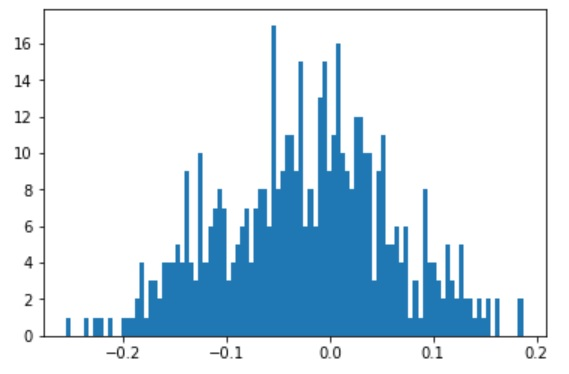
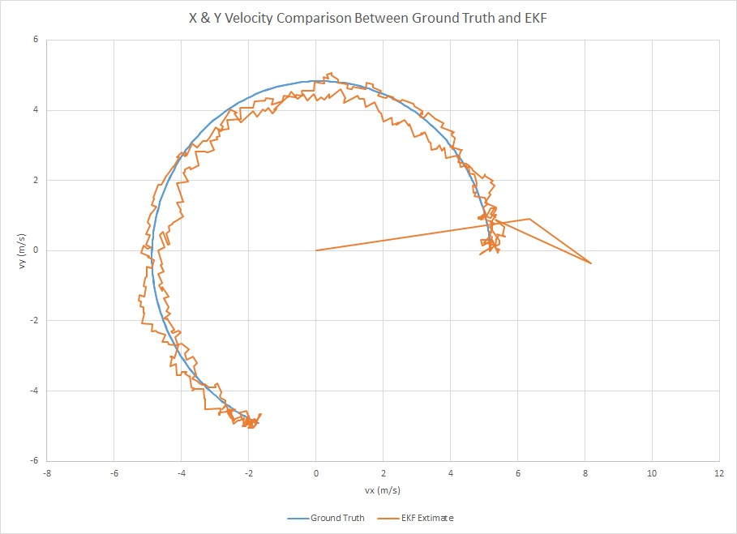

# Extended Kalman Filter Project
Self-Driving Car Engineer Nanodegree Program

The goal of this project is to utilize the extended kalman filter to estimate the state of a moving object of interest with noisy lidar and radar measurements.  The entire code is written is C++. 

## Build Instructions

1. Make a build directory: `mkdir build && cd build`
2. Compile: `cmake .. && make`
3. Run: `./ExtendedKF`

## Content of this repo
- `scr` a directory with the project code:
- `data`  a directory with two input files, provided by Udacity
- `results`  a directory with output files

## Results

The table below shows the RMSE values for Data set 1.

| Input |  RMSE   |
| ----- | ------- |
|  px   | 0.0972 |
|  py   | 0.0853 |
|  vx   | 0.4586 |
|  vy   | 0.4310 |

The table below shows the RMSE values for Data set 2.

| Input |  RMSE   |
| ----- | ------- |
|  px   | 0.0727 |
|  py   | 0.0965 |
|  vx   | 0.4230 |
|  vy   | 0.5273 |

To visualize each component (px, py, vx, vy), different plots are displayed:

Histogram of px (difference between EKF estimate and ground truth):

Histogram of py (difference between EKF estimate and ground truth):

Histogram of vx (difference between EKF estimate and ground truth):

Histogram of vy (difference between EKF estimate and ground truth):

x-y position plot.  The estimated positions are done quite well.

x-y velocity plot.  One can clearly see the estimated velocities are noisy.

X velocity plot.

Y velocity plot

To reduce the noise in velocity outputs, a couple techniques are tested.

1. Low pass filter.

    FusionEKF_LP.cpp, lines 163 to 191
    
    
2. Averaging EKF predicted velocity and velocity from previous frame's acceleration.

    FusionEKF_smooth.cpp, lines 163 to 170

Low pass filter RMSE:

| Input |  RMSE   |
| ----- | ------- |
|  px   | 0.1074 |
|  py   | 0.0968 |
|  vx   | 0.4790 |
|  vy   | 0.5304 |

Technique 2 RMSE:

| Input |  RMSE   |
| ----- | ------- |
|  px   | 0.0966 |
|  py   | 0.0831 |
|  vx   | 0.5390 |
|  vy   | 0.3907 |

x-y velocity plot (low-pass filter).  One can clearly see the estimated velocities are still noisy.  The current cut-off frequency is 4Hz.  If the cut-off frequency is lowered, the output signals will be smoother, but RMSE will be worse because out of phase output signal is stronger.

x-y velocity plot (smooth).  Comparing with original plot, this one is smoother.  The vy RMSE value is also lower.  However vx value is higher than the original.

Individual X and Y velocity plots.  One can also see the velocity noises are lowered.

To understand how each sensor performs individually, here are the plots:

### Laser Only

x-y position plot for laser only.  One can see the position estimates are less accurate than laser and radar combined.

x-y velocity plot for laser only.  One can see the velocity estimates are both noisy and less accurate.  This is expected since laser only provides direct position data.

### Radar Only

x-y position plot for radar only.  Although the raw radar measurements have more noise (lower resolution), radar provides direct velocity measurement, which helps kalman filter with position updates.  The overall position is more accurate than laser only, but still less accurate than both laser and radar result.

x-y velocity plot for radar only.  The output is still noisy, but a lot more accurate than laser data only.  This is due to direct velocity measurement from radar sensor.

EKF performs the best when both sensors are combined.  Laser sensor provides higher resolution position data while radar sensor provides direct velocity data

## FUTURE WORK

To improve kalman filter performance, unscented kalman filter is typically used since acceleration can be included in the state vector to estimate velocity and position.